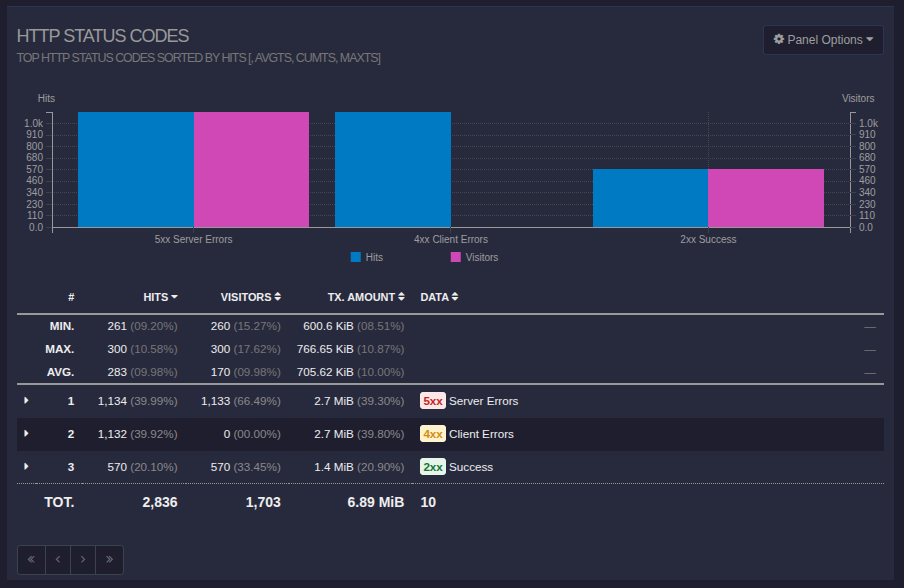
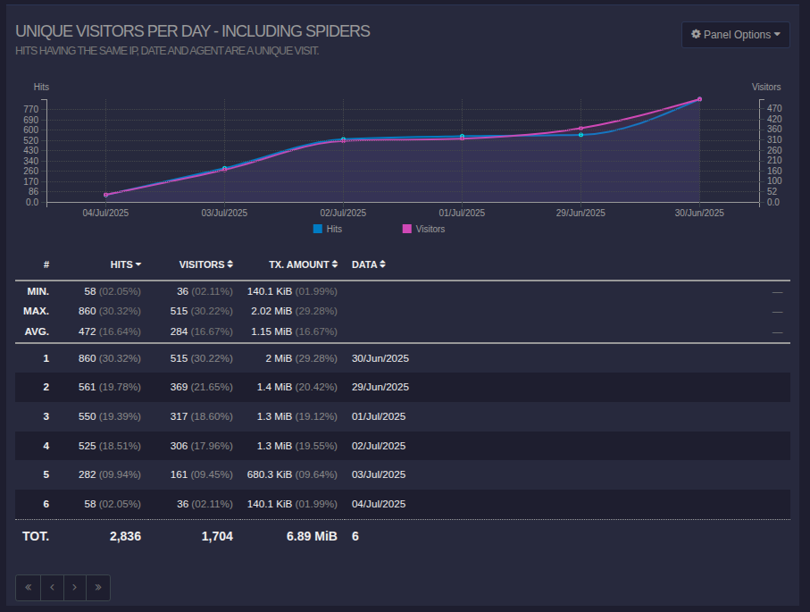

## Все записи, отстортированные по коду ответа

## Все уникальные IP, встречающиеся в записях

## Все запросы с ошибками
 

## Все уникальные IP, которые встречаются среди ошибочных запросов
Так как утилита работает с агрегированными данными, список этих IP вывести нельзя. В таком случае необходимо использовать терминал и команду awk.