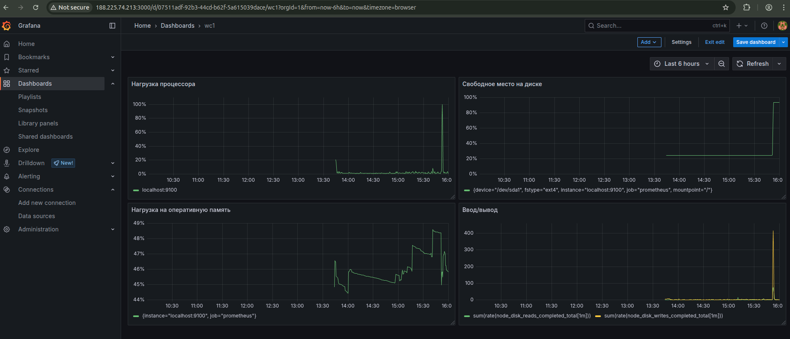

# Part 7. Prometheus и Grafana
## Создание VM и установка Prometheus, Grafana
1) В директории `create_vm` описал работу Terraform, где создается одна виртуальная машина (ВМ) на хостинге TimeWebCloud
2) В директории `install_tools` описана работа Ansible, создал 4 плейбука:
    - `install_prometheus.yml` - устанавливает и настраивает на ВМ Prometheus
    - `install_grafana.yml` - устанавливает Grafana
    - `install_node_exporter.yml` - устанавливает node_exporter на ВМ
    - `deploy_part2.yml` - копирует на ВМ скрипт из второго задания
3) Изменил на ВМ /etc/prometheus/prometheus.yml строку на<br>
```yaml
static_configs:
    - targets: ["localhost:9100"] #порт node_exporter, localhost потому что они находятся на одной ВМ
```
4) В веб-интерфейсе Grafana настроил дашборд по четырем метрикам
    - нагрузка процессора
    ```PromQL
    100 - (avg by(instance) (rate(node_cpu_seconds_total{mode="idle"}[1m])) * 100)
    ```
    - нагрузка на оперативную память
    ```PromQL
    (node_memory_MemTotal_bytes - node_memory_MemAvailable_bytes) / node_memory_MemTotal_bytes * 100
    ```
    - свободное место на диске
    ```PromQL
    (
        (node_filesystem_size_bytes{device="/dev/sda1", mountpoint="/"} 
        - 
        node_filesystem_avail_bytes{device="/dev/sda1", mountpoint="/"})
        / 
        node_filesystem_size_bytes{device="/dev/sda1", mountpoint="/"} 
        * 100
    )
    ```
    - ввод/вывод
    ```PromQL
    sum(rate(node_disk_reads_completed_total[1m]))
    ```
    ```PromQL
    sum(rate(node_disk_writes_completed_total[1m]))
    ```
<br>
5) Запустил скрипт из второго задания
<br>
6) Запустил команду `stress -c 2 -i 1 -m 1 --vm-bytes 32M -t 10s`
<br>
