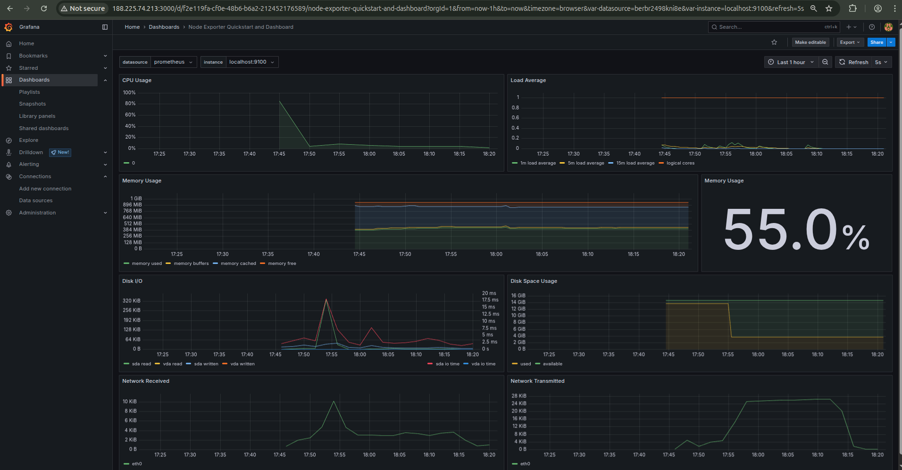
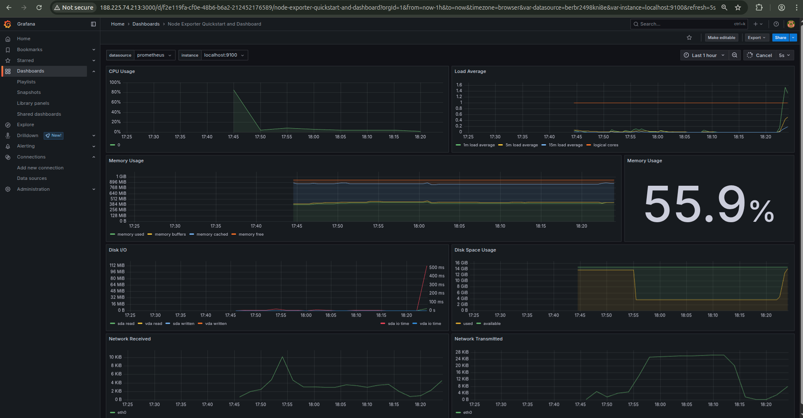

# Part 8. Готовый дашборд
1) Скачал из Grafana Labs файл json с готовым дашбордом `Node Exporter Quickstart and Dashboard`
2) Поменял в /etc/prometheus/prometheus.yml строку с job_name на `job_name: "node"`
готовый дашборд<br>
<br>
3) Запустил скрипт из второго задания
<br>
4) Поднял вторую ВМ, подключил оба в одну приватную сеть
5) Установил на обеих ВМ `iperf3`
6) Протестировал
<br>
```bash
iperf3 -s #на сервере
```
```bash
iperf3 -c 192.168.0.5 -t 30 #на клиенте
```
